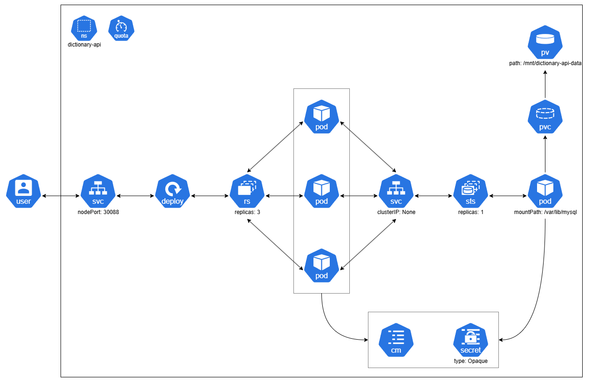

# Dictionary API - 📖 An simple API Backend for learning

Dictionary API is an API Backend used for learning about Kubernetes in the system deployment section with StatefulSet.

---

## Installation

```bash
git clone https://github.com/twoNDchances/dictionary-api.git
```

- Docker (build)

```bash
cd dictionary-api
docker compose up -d
```

- Docker (pull & MySQL server already setup)

```bash
docker run -d --name=dictionary-api -p 8080:8080 secondchances/dictionary-api
```

- Manualy (MySQL server already setup)

```bash
cd dictionary-api
$(cat export.txt)
go run .
```

- Kubernetes (non-production environment)

```bash
cd dictionary-api
kubectl apply -f kubernetes.yaml
```

---

## Usage

Dictionary API Backend has some endpoint with different method for CRUD about a dictionary, details:

```bash
GET api/v1/dictionaries # list all records

GET api/v1/dictionaries/{id} # specific a record with id

POST api/v1/dictionaries # create new record
{
    "key": "foo",
    "value": "bar"
}

PATCH api/v1/dictionaries/{id} # update a record with id
{
    "value": "other bar"
}

DELETE api/v1/dictionaries/{id} # delete a record with id
```

---

## Architecture

- Kubernetes


